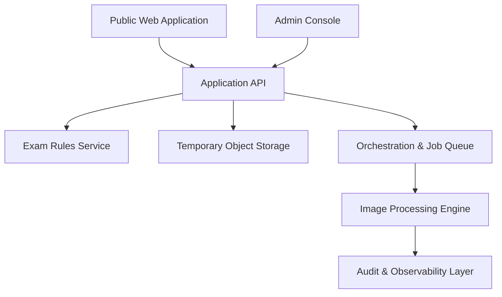

# Technical Architecture Specification (02_TECHNICAL_ARCHITECTURE.md)

This document describes the logical architecture, recommended implementation patterns, and deferred infrastructure decisions for the platform.

---

## 1. Logical Requirements

The system consists of the following decoupled functional components:

- **Public Web Application**: The front-end user interface where candidates search for an exam, review requirements, upload photographs, see previews, check validations, and download processed files.
- **Admin Console**: Interface for researchers and operators to insert, review, preview, publish, and version-control examination rule rules.
- **Application API**: Serves as the orchestration gateway, handling request flow, security controls, temporary uploads, rule lookups, and session tokens.
- **Examination-Rule Service**: Versioned repository providing immutable rule configurations and schema validation.
- **Image Processing Engine**: Decoupled engine executing face detection, head boundary analysis, background removal, crop processing, restrained adjustments, and format conversion.
- **Temporary Private Object Storage**: Secure, short-lived storage for original uploads, intermediate processing layers, and final output photos.
- **Processing Job Orchestration**: Manages task flows, retry loops, and deletion triggers.
- **Validation Contracts**: Rigid structures verifying input suitability, pipeline execution quality, and output compliance.
- **Audit Logging & Observability**: Logs processing times, errors, quality thresholds, and administrative rule edits.
- **Deletion Lifecycle**: Enforces automated deletions of all session objects, source files, and intermediate outputs.
- **Future Payment Boundary**: A gateway wrapper to isolate checkout states from core image processing.

---

## 2. Recommended Initial Implementation

For the initial prototype and MVP phases, the following stack is recommended:

- **Monorepo Structure**: Separate services and applications for clean boundaries.
- **Image Processing Engine**: Python library built around Pillow and specialized computer vision packages.
- **API and Rules Service**: FastAPI (Python) or NestJS (Node.js) server.
- **Queue/Orchestrator**: Celery or BullMQ with Redis for job state.
- **Front-end Applications**: React with Vite for high performance and lightweight builds.
- **Inter-service contracts**: JSON Schema definitions.

### Image Processing Provider Abstractions

To ensure the Image Processing Engine remains decoupled from specific computer vision backends (e.g., MediaPipe, OpenCV, or ONNX Runtime), it utilizes a provider-neutral abstraction layer defined via abstract base classes:
- `FaceDetectionProvider`: Interface for face bounding-box detection and landmark extraction.
- `HeadEstimationProvider`: Interface for estimating complete-head boundaries from facial geometry.
- `SubjectSegmentationProvider`: Interface for portrait segmentation and coarse foreground-mask generation.

---

## 3. Deferred Infrastructure Decisions

To prevent premature vendor lock-in, decisions on the following infrastructure items are deferred:

- **Hosting & Cloud Provider**: Choice between AWS (ECS/Fargate/S3), GCP (Cloud Run/Cloud Storage), or local bare-metal configurations.
- **Object Storage Service**: Choices like AWS S3, Google Cloud Storage, or MinIO.
- **Database Engine**: Decision between PostgreSQL (with JSONB support) or MongoDB.
- **Task Deletion Scheduler**: System-level cron, cloud events scheduler, or native database TTL triggers.
- **Commercial Billing Systems**: Selection of payment providers like Stripe or Razorpay.
