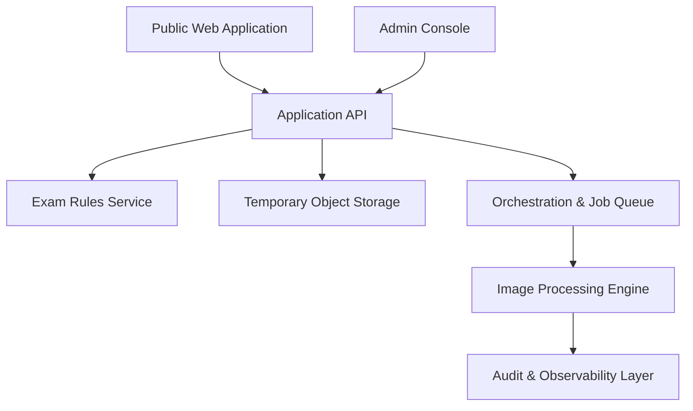

# Technical Architecture Specification (02_TECHNICAL_ARCHITECTURE.md)

This document describes the logical architecture, recommended implementation patterns, and deferred infrastructure decisions for the platform.

---

## 1. Logical Requirements

The system consists of the following decoupled functional components:

- **Public Web Application**: The front-end user interface where candidates search for an exam, review requirements, upload photographs, see previews, check validations, and download processed files.
- **Admin Console**: Interface for researchers and operators to insert, review, preview, publish, and version-control examination rule rules.
- **Application API**: Serves as the orchestration gateway, handling request flow, security controls, temporary uploads, rule lookups, and session tokens.
- **Examination-Rule Service**: Versioned repository providing immutable rule configurations and schema validation.
- **Image Processing Engine**: Decoupled engine executing face detection, head boundary analysis, background removal, crop processing, restrained adjustments, and format conversion.
- **Suitability & Disposition Layer**: Measures the uploaded photograph and classifies it accept, warn or block (DEC-041), and plans any natural enhancement from measured capture defects (DEC-043). Deliberately split into measurement and policy so the policy is testable without a model.
- **Matting Model Assets**: Vendored, checksum-verified model weights resolved from `model-manifests/`. These are gitignored and acquired by download scripts; the manifest pins the revision and checksum that the engine verifies before use.
- **Temporary Private Object Storage**: Secure, short-lived storage for original uploads, intermediate processing layers, and final output photos.
- **Processing Job Orchestration**: Manages task flows, retry loops, and deletion triggers.
- **Validation Contracts**: Rigid structures verifying input suitability, pipeline execution quality, and output compliance.
- **Audit Logging & Observability**: Logs processing times, errors, quality thresholds, and administrative rule edits.
- **Deletion Lifecycle**: Enforces automated deletions of all session objects, source files, and intermediate outputs.
- **Future Payment Boundary**: A gateway wrapper to isolate checkout states from core image processing.

---

## 2. Recommended Initial Implementation

For the initial prototype and MVP phases, the following stack is recommended:

> **Revised 2026-08-04 to record what was actually built**, since two entries
> below described alternatives that were not chosen.

- **Monorepo Structure**: Separate services and applications for clean boundaries. *(As built.)*
- **Image Processing Engine**: Python library built around Pillow, NumPy, MediaPipe for face detection and dense landmarks, and PyTorch for BiRefNet portrait matting. *(As built.)*
- **API and Rules Service**: FastAPI (Python), exposed by the `serve-api` CLI subcommand. *(As built — NestJS was not used.)*
- **Front-end Applications**: **Next.js (App Router) with React**, not React with Vite. *(As built — this entry was stale.)*
- **Queue/Orchestrator**: **Still to be chosen.** Jobs are currently executed synchronously behind an opaque job id with manifest persistence, which is adequate locally and not adequate publicly. Selecting a queue is part of Milestone 24, and the choice depends on whether inference moves to GPU.
- **Inter-service contracts**: JSON Schema definitions, canonical in `packages/exam-rules`, mirrored by Pydantic models in the engine and TypeScript types in the web app. *(As built.)*

### Known architectural gaps

- **Throughput is unproven.** Measured 16-24 seconds per photograph on CPU, roughly doubled by the crop-region rematte. There is no queue, no backpressure and no autoscaling. This is the largest open risk and is Milestone 24.
- **The API is not public-facing.** No TLS, authentication or rate limiting; it is documented as local-only. Milestone 25.
- **Audit logging and observability** exist as a design element above but not as an implementation.

### Image Processing Provider Abstractions

To ensure the Image Processing Engine remains decoupled from specific computer vision backends (e.g., MediaPipe, OpenCV, or ONNX Runtime), it utilizes a provider-neutral abstraction layer defined via abstract base classes:
- `FaceDetectionProvider`: Interface for face bounding-box detection and landmark extraction.
- `HeadEstimationProvider`: Interface for estimating complete-head boundaries from facial geometry.
- `SubjectSegmentationProvider`: Interface for portrait segmentation and coarse foreground-mask generation.

---

## 3. Deferred Infrastructure Decisions

To prevent premature vendor lock-in, decisions on the following infrastructure items are deferred:

- **Hosting & Cloud Provider**: Choice between AWS (ECS/Fargate/S3), GCP (Cloud Run/Cloud Storage), or local bare-metal configurations.
- **Object Storage Service**: Choices like AWS S3, Google Cloud Storage, or MinIO.
- **Database Engine**: Decision between PostgreSQL (with JSONB support) or MongoDB.
- **Task Deletion Scheduler**: System-level cron, cloud events scheduler, or native database TTL triggers.
- **Commercial Billing Systems**: Selection of payment providers like Stripe or Razorpay.
